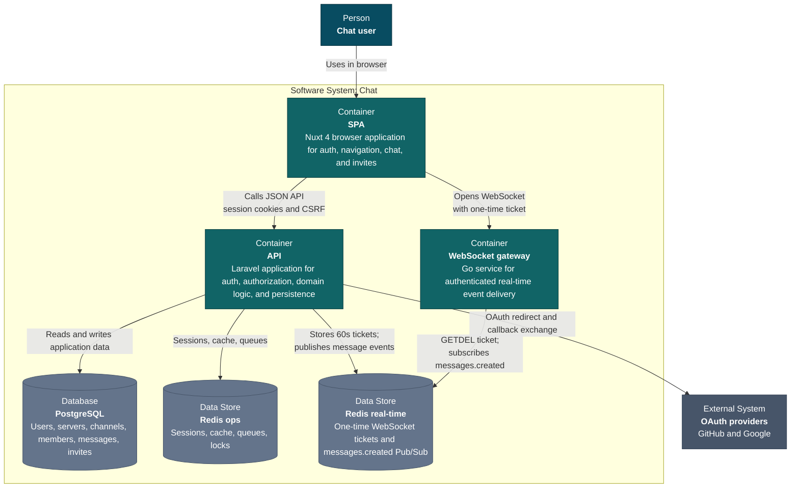

# Chat

A full-stack real-time chat application with a Nuxt SPA, Laravel API, and a small Go
WebSocket gateway. The default deployment runs behind Traefik and uses
PostgreSQL, two isolated Redis instances, and S3-compatible object storage.


## Features

- Session authentication with Laravel Sanctum
- GitHub and Google OAuth support
- Servers, channels, members, messages, and invite links
- Real-time message delivery over authenticated WebSockets
- Redis-backed sessions, cache, queues, and broadcasts
- Horizon queue monitoring and optional Telescope diagnostics
- Docker development and production targets

## Architecture

[General architecture](https://miro.com/app/board/uXjVHFMr590=/?share_link_id=24571891911) (C4 container level)



```text
Browser
  |
  v
Traefik
  |-- /                       -> Nuxt frontend
  |-- /api, /auth, /sanctum   -> Nginx -> Laravel PHP-FPM
  |-- /ws                     -> Go WebSocket gateway
  |
  |-- Laravel -> PostgreSQL
  |-- Laravel -> Redis (operations)
  |-- Laravel -> Redis (real-time) -> WebSocket gateway
  `-- Laravel -> RustFS (S3-compatible storage)
```

| Directory | Purpose |
| --- | --- |
| [`backend`](backend/README.md) | Laravel API, domain logic, queues, and persistence |
| [`frontend`](frontend/README.md) | Nuxt single-page application |
| [`ws`](ws/README.md) | Go WebSocket authentication and broadcast gateway |
| `docker` | Container images and service configuration |

## Requirements

- Docker Engine with Docker Compose v2
- OpenSSL for generating a local application key

Node.js 24, PHP 8.5, Composer, and Go 1.26 are only required when running
service-level commands directly on the host.

## Quick Start

1. Create the local environment file:

   ```bash
   cp .env.example .env
   ```

2. Generate a Laravel application key:

   ```bash
   key="base64:$(openssl rand -base64 32)"
   sed -i "s|^APP_KEY=.*|APP_KEY=${key}|" .env
   ```

3. Build and start the development stack:

   ```bash
   docker compose --env-file .env -f compose.yaml -f compose.dev.yaml up --build -d
   ```

4. Seed local roles and sample data:

   ```bash
   docker compose --env-file .env -f compose.yaml -f compose.dev.yaml \
     exec api-php php artisan db:seed
   ```

The sample users all use `password`. To print one generated email:

```bash
docker compose --env-file .env -f compose.yaml -f compose.dev.yaml exec api-php \
  php artisan tinker --execute="echo App\\Models\\User::query()->value('email').PHP_EOL;"
```

## Development URLs

| Service | URL |
| --- | --- |
| Application | <http://localhost> |
| API health | <http://localhost/api/health> |
| Horizon | <http://localhost/horizon> |
| Telescope | <http://localhost/telescope> |
| Traefik dashboard | <http://localhost:8080> |
| Mailpit | <http://localhost:8025> |
| RedisInsight | <http://localhost:5540> |
| RustFS console | <http://localhost:9001> |

PostgreSQL, Redis, and RustFS ports are bound to `127.0.0.1`; their defaults
are listed in [`.env.example`](.env.example). PgAdmin is available through the
optional `tools` profile:

```bash
docker compose --env-file .env -f compose.yaml -f compose.dev.yaml \
  --profile tools up -d pgadmin
```

## Common Commands

```bash
# Follow all service logs
docker compose --env-file .env -f compose.yaml -f compose.dev.yaml logs -f

# Run Laravel tests
docker compose --env-file .env -f compose.yaml -f compose.dev.yaml exec api-php \
  php artisan test --compact

# Run an Artisan command
docker compose --env-file .env -f compose.yaml -f compose.dev.yaml exec api-php \
  php artisan route:list

# Stop the stack
docker compose --env-file .env -f compose.yaml -f compose.dev.yaml down

# Stop the stack and delete local volumes
docker compose --env-file .env -f compose.yaml -f compose.dev.yaml down -v
```

## Validation

Before pushing changes, run:

```bash
(cd backend && composer validate --strict --no-interaction && php artisan test --compact)
(cd frontend && npm run lint && npm run build)
(cd ws && test -z "$(gofmt -l .)" && go test ./...)
docker compose --env-file .env -f compose.yaml config --quiet
docker compose --env-file .env -f compose.yaml -f compose.dev.yaml config --quiet
```

## Production

Production uses `compose.yaml` without the development override:

```bash
cp .env.production.example .env.production
# Replace every change-me value and configure the production hostname.
chmod 600 .env.production
docker compose --env-file .env.production -f compose.yaml build --pull
docker compose --env-file .env.production -f compose.yaml up -d --remove-orphans
```

Configure at least:

- `APP_DOMAIN`, `APP_URL`, and `APP_FRONTEND_URL`
- `APP_KEY`
- PostgreSQL and Redis passwords
- RustFS/S3 credentials and URLs
- `NUXT_PUBLIC_API_BASE`, `NUXT_PUBLIC_APP_URL`, and `NUXT_PUBLIC_WS_URL`
- `TRAEFIK_ACME_EMAIL`
- OAuth client credentials when social login is enabled

Compose rejects missing application, database, Redis, and RustFS/S3 secrets.

`AWS_URL` is intentionally empty by default. Set it only when the object
storage bucket is exposed through a real public URL or CDN.

Traefik accesses Docker through an internal read-only API proxy. Do not expose
the `docker-proxy` service or its port outside the private Compose network.
Each Traefik instance only discovers containers from its own Compose project.

The stack runs database migrations automatically during startup. Back up the
PostgreSQL and RustFS volumes before upgrades, and keep an off-host backup for
any deployment that stores real user data.

## License

This project is not open source. The code is made available for 
evaluation and portfolio review purposes only. You may not use, 
copy, modify, or distribute it without explicit written permission 
from the author.

© 2026 [bugcolony](https://github.com/bugcolony). All rights reserved.
