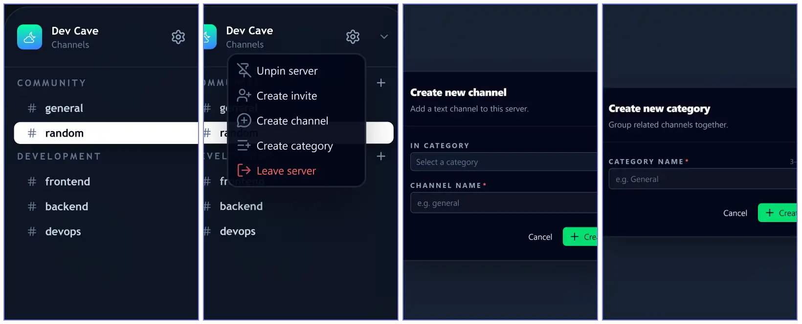
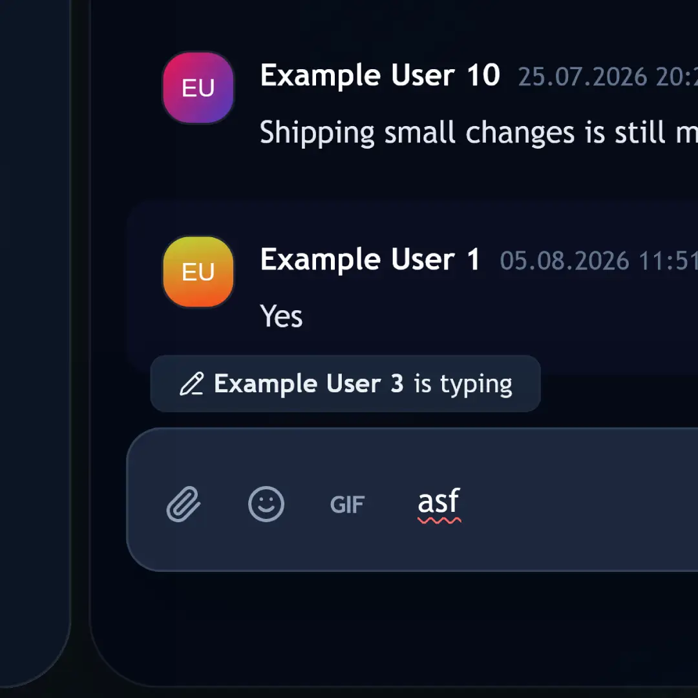
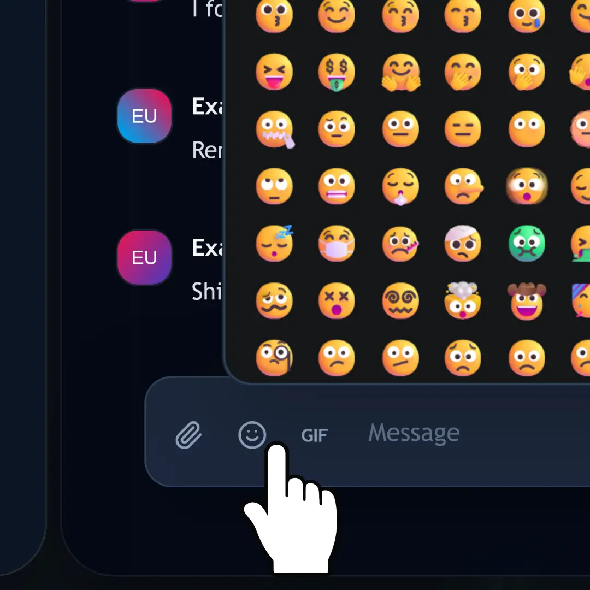
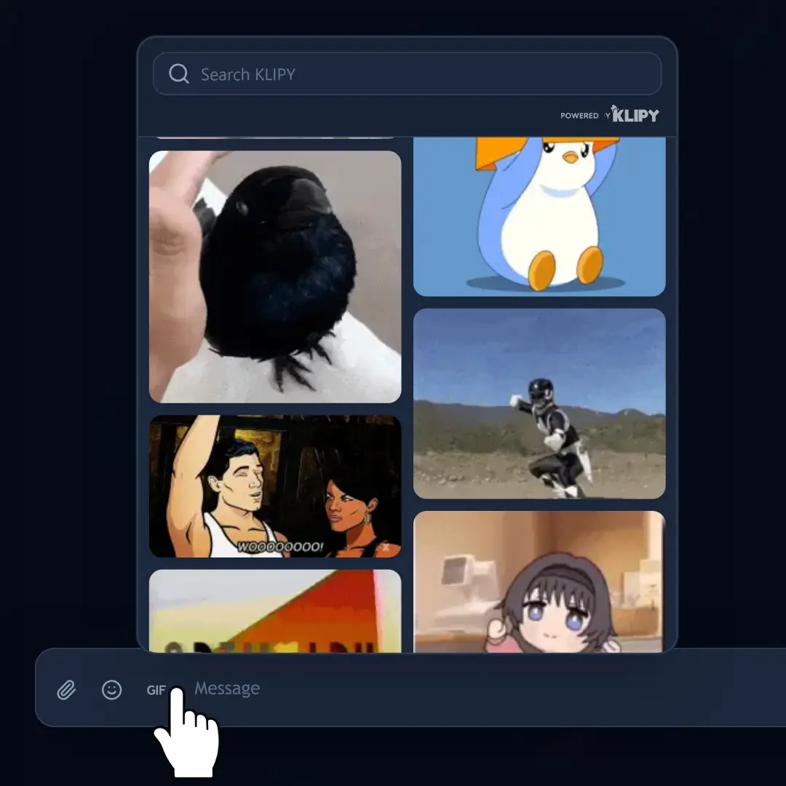
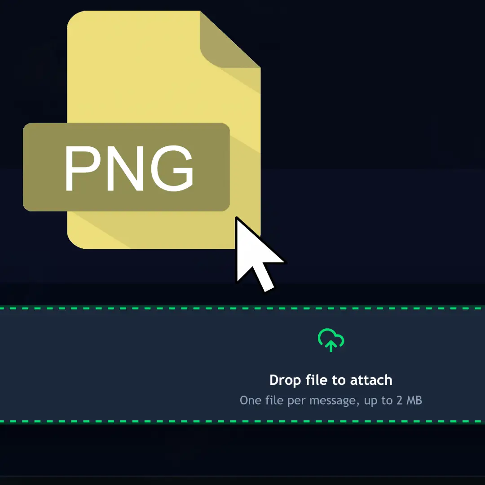
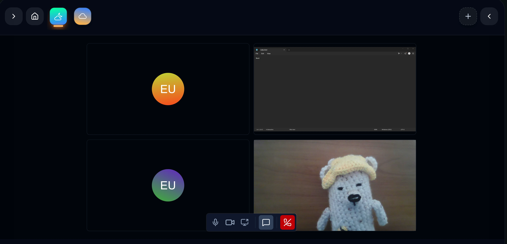
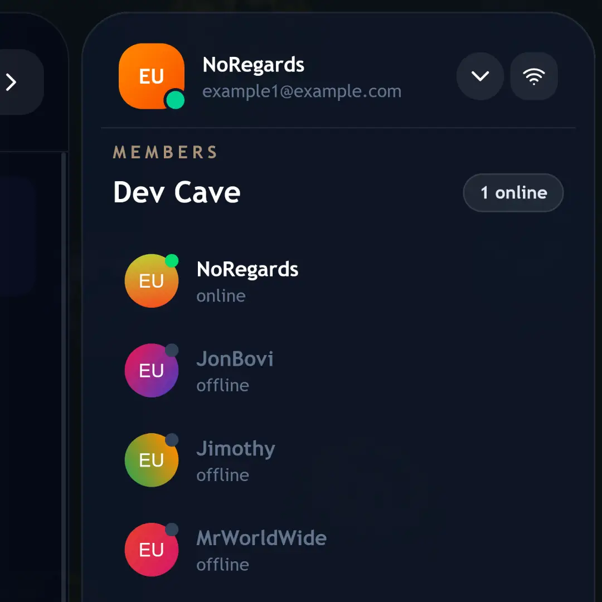
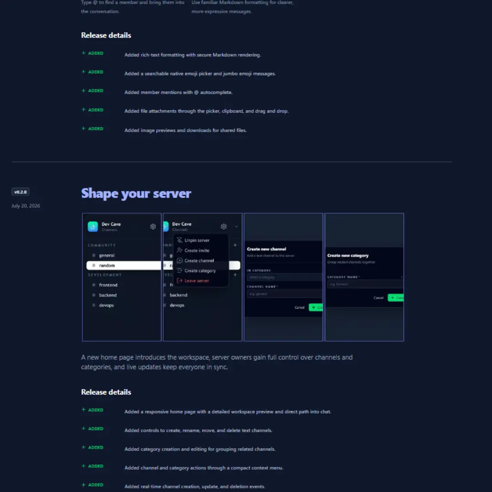
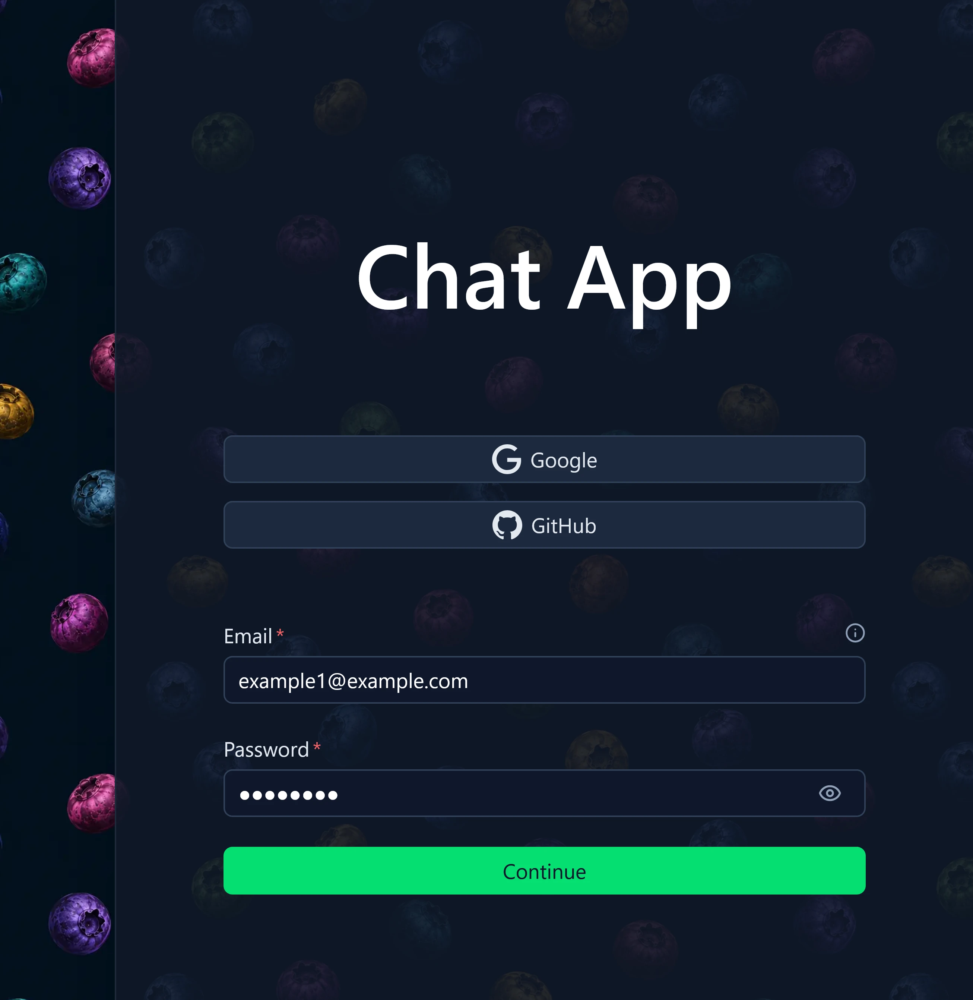
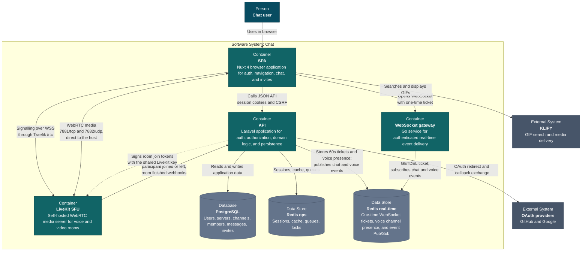

# Chat

A full-stack real-time chat application with a Nuxt SPA, Laravel API, and a small Go
WebSocket gateway. The default deployment runs behind Traefik and uses
PostgreSQL, two isolated Redis instances, and S3-compatible object storage.


## Features

### Servers, channels, and categories



Create a server, group channels under categories, and manage the whole tree from a context menu: create, rename, move, and delete without leaving the sidebar. Invite links survive the sign-in flow, so a new member lands in the right server after authenticating.

### Real-time messaging



Messages arrive over an authenticated WebSocket connection served by the Go gateway, which subscribes to Redis Pub/Sub and fans events out to the browsers watching a channel. Typing indicators and unread counts ride the same connection — no polling anywhere in the path.

### A composer that keeps up



Markdown formatting with sanitised rendering, a searchable native emoji picker, jumbo emoji for emoji-only messages, and `@` autocomplete for member mentions — all inline, without switching context away from the conversation.

### GIF search built in



Browse trending GIFs or search the [KLIPY](https://klipy.com) catalogue straight from the composer. Preview a result and send it into the channel without opening another tab.

### Attachments



Attach a file through the picker, the clipboard, or by dropping it onto the composer. Uploads land in S3-compatible object storage, and images get inline previews and a download action in the thread.

### Voice and video channels



Voice channels are a channel type, so they sit in the same sidebar with the members currently inside them listed underneath. Join with one click, then unmute, turn on the camera, or share a screen from the call bar — every participant gets a tile that highlights while they speak. Media runs through a self-hosted [LiveKit](https://livekit.io) SFU, and each voice channel carries its own text chat you can toggle open beside the call.

### Live presence



The member panel shows who is online, keeps the count current as people connect and drop, and marks offline members without hiding them.

### What’s New page



Product updates ship with the app. Each release gets an entry with screenshots and a categorised changelog, rendered from plain data files the frontend picks up automatically.

### Sign-in and OAuth



Session authentication with Laravel Sanctum, plus GitHub and Google OAuth. Sessions recover on reload and protected routes stay closed until the session resolves.

### Under the hood

- Redis-backed sessions, cache, queues, locks, and broadcasts, split across two isolated instances
- One-time WebSocket tickets minted by the API and redeemed by the Go gateway
- Horizon queue monitoring and optional Telescope diagnostics
- Docker development and production targets behind Traefik

## Architecture

[General architecture](https://miro.com/app/board/uXjVHFMr590=/?share_link_id=24571891911) (C4 container level)



```text
Browser
  |
  v
Traefik
  |-- /                       -> Nuxt frontend
  |-- /api, /auth, /sanctum   -> Nginx -> Laravel PHP-FPM
  |-- /ws                     -> Go WebSocket gateway
  |-- /rtc                    -> LiveKit signalling (WebSocket)
  |
  |-- Laravel -> PostgreSQL
  |-- Laravel -> Redis (operations)
  |-- Laravel -> Redis (real-time) -> WebSocket gateway
  `-- Laravel -> RustFS (S3-compatible storage)

Browser <-> LiveKit media, bypassing Traefik
  |-- 7881/tcp (ICE over TCP)
  `-- 7882/udp (UDP mux)

LiveKit -> Laravel webhook -> Redis (real-time) -> WebSocket gateway -> Browser
```

### Voice and video path

Voice channels do not go through the WebSocket gateway. They run against a
self-hosted LiveKit SFU, and the API is only involved at the edges:

1. The SPA asks the API for credentials: `POST /api/v1/channels/{channel}/credentials`.
   Channel membership is checked, then `LiveKitAccessService` signs a join token
   with the shared LiveKit key. The token carries the user id as the participant
   identity and grants access to exactly one room, named `channel:{id}`.
2. The browser opens signalling to LiveKit over WSS. Traefik routes `/rtc` to the
   container's `7880` port; media never touches the proxy.
3. WebRTC media flows straight to the host on `7881/tcp` (ICE over TCP) and
   `7882/udp` (UDP mux). `LIVEKIT_NODE_IP` is what LiveKit writes into its ICE
   candidates, so it has to be the address browsers can actually reach.
4. LiveKit posts `participant_joined`, `participant_left`, and `room_finished`
   webhooks to `POST /api/v1/rtc/events` over the internal network. The signature
   is verified against the same shared key before anything is trusted.
5. The API keeps a Redis set per voice channel (`voice:channel:{id}`) and
   publishes a gateway event, which the Go gateway fans out over the existing
   WebSocket connection. That is how the roster under a voice channel updates for
   everyone, including people who never joined the call.
6. `GET /api/v1/servers/{server}/voice-presence` returns the snapshot a client
   needs on load, before any live event arrives.

Rooms are capped at 5 participants in [`docker/livekit/livekit.yaml`](docker/livekit/livekit.yaml).
Deployment specifics - node IP, firewall ports, and key generation - are covered
under [Production](#production).

| Directory | Purpose |
| --- | --- |
| [`backend`](backend/README.md) | Laravel API, domain logic, queues, and persistence |
| [`frontend`](frontend/README.md) | Nuxt single-page application |
| [`ws`](ws/README.md) | Go WebSocket authentication and broadcast gateway |
| `docker` | Container images and service configuration |

## Requirements

- Docker Engine with Docker Compose v2
- OpenSSL for generating a local application key

Node.js 24, PHP 8.5, Composer, and Go 1.26 are only required when running
service-level commands directly on the host.

## Quick Start

1. Create the local environment file:

   ```bash
   cp .env.example .env
   ```

2. Generate a Laravel application key:

   ```bash
   key="base64:$(openssl rand -base64 32)"
   sed -i "s|^APP_KEY=.*|APP_KEY=${key}|" .env
   ```

3. Build and start the development stack:

   ```bash
   docker compose --env-file .env -f compose.yaml -f compose.dev.yaml up --build -d
   ```

4. Seed local roles and sample data:

   ```bash
   docker compose --env-file .env -f compose.yaml -f compose.dev.yaml \
     exec api-php php artisan db:seed
   ```

The sample users all use `password`. To print one generated email:

```bash
docker compose --env-file .env -f compose.yaml -f compose.dev.yaml exec api-php \
  php artisan tinker --execute="echo App\\Models\\User::query()->value('email').PHP_EOL;"
```

## Development URLs

| Service | URL |
| --- | --- |
| Application | <http://localhost> |
| API health | <http://localhost/api/health> |
| Horizon | <http://localhost/horizon> |
| Telescope | <http://localhost/telescope> |
| Traefik dashboard | <http://localhost:8080> |
| Mailpit | <http://localhost:8025> |
| RedisInsight | <http://localhost:5540> |
| RustFS console | <http://localhost:9001> |

PostgreSQL, Redis, and RustFS ports are bound to `127.0.0.1`; their defaults
are listed in [`.env.example`](.env.example).

LiveKit signalling is routed by Traefik under `/rtc`, but WebRTC media bypasses
the proxy: `7881/tcp` (ICE/TCP) and `7882/udp` (UDP mux) are published straight
to the host. `LIVEKIT_NODE_IP` is the address advertised to browsers as the ICE
candidate, so it must match how the browser reaches those ports - loopback when
the browser runs on the Docker host, the VM address otherwise.

PgAdmin is available through the optional `tools` profile:

```bash
docker compose --env-file .env -f compose.yaml -f compose.dev.yaml \
  --profile tools up -d pgadmin
```

## Common Commands

```bash
# Follow all service logs
docker compose --env-file .env -f compose.yaml -f compose.dev.yaml logs -f

# Run Laravel tests
docker compose --env-file .env -f compose.yaml -f compose.dev.yaml exec api-php \
  php artisan test --compact

# Run an Artisan command
docker compose --env-file .env -f compose.yaml -f compose.dev.yaml exec api-php \
  php artisan route:list

# Stop the stack
docker compose --env-file .env -f compose.yaml -f compose.dev.yaml down

# Stop the stack and delete local volumes
docker compose --env-file .env -f compose.yaml -f compose.dev.yaml down -v
```

## Validation

Before pushing changes, run:

```bash
(cd backend && composer validate --strict --no-interaction && php artisan test --compact)
(cd frontend && npm test && npm run lint && npm run generate)
(cd ws && test -z "$(gofmt -l .)" && go test ./...)
docker compose --env-file .env -f compose.yaml config --quiet
docker compose --env-file .env -f compose.yaml -f compose.dev.yaml config --quiet
```

## Production

Production uses `compose.yaml` without the development override:

```bash
cp .env.production.example .env.production
# Replace every change-me value and configure the production hostname.
chmod 600 .env.production
docker compose --env-file .env.production -f compose.yaml build --pull
docker compose --env-file .env.production -f compose.yaml up -d --remove-orphans
```

GitHub Actions validates pull requests and pushes to `main`. Production deploys
only when a release tag matching `vMAJOR.MINOR.PATCH` is pushed:

```bash
git switch main
git pull
git tag -a v1.2.3 -m "Release v1.2.3"
git push origin v1.2.3
```

Configure at least:

- `APP_DOMAIN`, `APP_URL`, and `APP_FRONTEND_URL`
- `APP_KEY`
- PostgreSQL and Redis passwords
- RustFS/S3 credentials and URLs
- `NUXT_PUBLIC_API_BASE`, `NUXT_PUBLIC_APP_URL`, `NUXT_PUBLIC_WS_URL`,
  `NUXT_PUBLIC_RTC_URL`, and `NUXT_PUBLIC_KLIPY_API_KEY`
- `TRAEFIK_ACME_EMAIL`
- `LIVEKIT_API_KEY`, `LIVEKIT_API_SECRET`, and `LIVEKIT_NODE_IP`
- OAuth client credentials when social login is enabled

Compose rejects missing application, database, Redis, and RustFS/S3 secrets.

Voice needs two things that nothing else in the stack does. `LIVEKIT_NODE_IP`
must be the host's public IP, because it is written verbatim into the ICE
candidates browsers dial; the container cannot discover it on its own. And
`7881/tcp` and `7882/udp` must be open inbound on the host firewall. Signalling
travels over 443 like everything else, so a closed media port leaves voice
channels that connect, list participants, and carry no audio.

Generate the keypair with the server binary, and note that a secret shorter
than 32 characters makes LiveKit refuse to start:

```bash
docker run --rm livekit/livekit-server:v1.13.5 generate-keys
```

`NUXT_PUBLIC_RTC_URL` is baked into the SPA at build time, so it must also be
set as a repository variable for GitHub Actions - changing it later requires a
rebuild, not a restart.

Nothing validates `LIVEKIT_NODE_IP`. A value LiveKit cannot parse is discarded
silently and the container advertises its own bridge address instead, so the
only signal is that voice stops working. Confirm the advertised address after
every deploy:

```bash
docker compose --env-file .env.production -f compose.yaml \
  logs livekit | grep -o '"nodeIP": "[^"]*"' | head -1
```

`AWS_URL` is intentionally empty by default. Set it only when the object
storage bucket is exposed through a real public URL or CDN.

Traefik accesses Docker through an internal read-only API proxy. Do not expose
the `docker-proxy` service or its port outside the private Compose network.
Each Traefik instance only discovers containers from its own Compose project.

The stack runs database migrations automatically during startup. Back up the
PostgreSQL and RustFS volumes before upgrades, and keep an off-host backup for
any deployment that stores real user data.

## License

This project is not open source. The code is made available for 
evaluation and portfolio review purposes only. You may not use, 
copy, modify, or distribute it without explicit written permission 
from the author.

© 2026 [bugcolony](https://github.com/bugcolony). All rights reserved.
